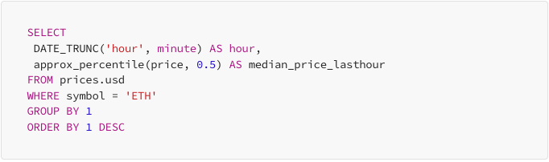

**Task 1:** Go through the Ethereum ecosystem and provide a brief
overview of the essential protocols in each category

1.  Exchange

    a.  [Synthetix]{.mark}

        i.  [Created in 2017 in the ICO (Initial Coin Offering)
            > era.]{.mark}

        ii. [Decentralized finance (DeFi) platform]{.mark}

        iii. [Provide liquidity for Ethereum Virtual Machine (EVM)
             > compatible chains (future, options, staking,
             > swap)]{.mark}

2.  Tools assets management tools

    a.  Dune

        i.  Can access to publicly available blockchain data

        ii. Can use SQL to query the data on blockchain

        iii. Can analytic and create charts and metrics

        iv. Can easily find the most trending
            > cryptocurrency{width="6.5in"
            > height="1.9305555555555556in"}

3.  Infrastructure & Dev Tooling

    a.  Chainlink

        i.  Chainlink is a blockchain-based **decentralized oracle
            > network** that was launched in 2017

        ii. Chainlink is an **open-source** blockchain project

        iii. Supporting **cross-blockchain** interoperability

        iv. Using **Hybrid Smart Contracts**

4.  Stable Coin

    a.  DAI

        i.  A decentralized stablecoin

        ii. DAI is backed by the very first DeFi protocols on Ethereum -
            > **MakerDAO**

        iii. The largest decentralized stablecoins in DeFi.

**Task 2:** Provide a brief overview of at least 5 Layer 2 chain

  -------------------------------------------------------------------------------
  Name        Type             Brief Description
  ----------- ---------------- --------------------------------------------------
  Optimism    Optimistic       Processes transactions off-chain, assumes validity
              rollup           unless proven fraudulent.

  Arbitrum    Optimistic       Focuses on speed and low fees, while maintaining
              rollup           EVM compatibility.

  zkSync      Zero-knowledge   Uses cryptographic proofs to verify transactions,
              rollup           offering high security.

  Polygon     Hybrid           Offers multiple scaling solutions, including
                               optimistic and zk-rollups.

  Immutable X Layer-2 for NFTs Specifically designed for scaling NFT
                               transactions.
  -------------------------------------------------------------------------------

Here is some main types of layer 2

### **1. Optimistic Rollups**

-   **How it works:** Processes transactions off-chain in batches.
    > Assumes transactions are valid unless proven fraudulent.

-   **Key characteristics:** Faster, cheaper, and more scalable than
    > Layer 1.

-   **Examples:** Optimism, Arbitrum

### **2. Zero-Knowledge Rollups (ZK-Rollups)**

-   **How it works:** Uses complex cryptographic proofs to verify
    > transaction validity without revealing transaction data.

-   **Key characteristics:** Highest level of security, but can be more
    > complex and expensive to implement

**Task 3:** Search for Dapps in Metis and fill in the protocols as per
task 1

1.  [Lyra]{.mark}

    a.  [[[Relies on various projects within the]{.underline}]{.mark}
        > **[[Synthetix ecosystem]{.underline}]{.mark}** [[for its
        > backend
        > operations]{.underline}]{.mark}](https://members.delphidigital.io/projects/lyra)[.]{.mark}

    b.  [[[Lyra is a decentralized finance options platform that
        > operates on the Optimism
        > network]{.underline}]{.mark}](https://members.delphidigital.io/projects/lyra)

2.  [Curves]{.mark}

    a.  [Using Dune on
        > [[dashboard]{.underline}](https://classic.curve.fi/combinedstats)
        > analytic]{.mark}

    b.  [Can use Curve on Arbitrum or Optimism to easily swap between
        > wstETH and ETH]{.mark}

3.  [Arkanys]{.mark}

    a.  [Arkanys merges video games, blockchain and artificial
        > intelligence to radically transform the gaming
        > industry.]{.mark}

    b.  [Using Optimism protocol]{.mark}

    c.  [[[In the Chainlink
        > Ecosystem]{.underline}]{.mark}](https://www.chainlinkecosystem.com/ecosystem/arkanys)

4.  Meta Mask

    a.  Can swap, store and transfer **DAI** token
